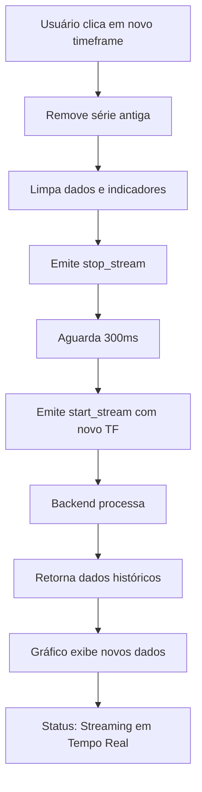

# 🔧 Correção do Seletor de Timeframe

## ❌ Problema Identificado

O timeframe estava mudando no display mas o gráfico não estava recarregando com novos dados.

## ✅ Correções Implementadas

### 1. **Limpeza Completa do Gráfico**
Agora ao mudar o timeframe, o sistema:
- ✅ Remove a série de candlesticks antiga
- ✅ Remove todos os indicadores ativos
- ✅ Limpa os dados do array `candleData`
- ✅ Reseta o contador `priceUpdateCount`
- ✅ Recria uma nova série de candlesticks

### 2. **Sincronização de Estado**
- ✅ Atualiza a variável `currentTimeframe`
- ✅ Sincroniza o dropdown select com os botões da toolbar
- ✅ Atualiza o estado dos botões de timeframe
- ✅ Reseta os indicadores técnicos

### 3. **Reconexão Melhorada**
```javascript
// Sequência correta:
1. Emite 'stop_stream'
2. Aguarda 300ms
3. Emite 'start_stream' com novo timeframe
4. Backend processa e retorna novos dados
```

### 4. **Feedback Visual**
- Status muda para "Reconectando..."
- Depois para "Carregando dados históricos..."
- Por fim "Streaming em Tempo Real"

## 🎯 Como Usar Agora

### Passo 1: Inicie o Stream
```
1. Digite o símbolo (ex: BINANCE:BTCUSDT)
2. Clique em "Iniciar Stream"
3. Aguarde carregar (status: "Streaming em Tempo Real")
```

### Passo 2: Mude o Timeframe
```
1. Clique em qualquer botão de timeframe na toolbar do gráfico
2. O sistema irá:
   - Limpar o gráfico atual
   - Mostrar "Reconectando..."
   - Carregar novos dados históricos
   - Exibir "Streaming em Tempo Real" quando pronto
```

### Passo 3: Adicione Indicadores (Opcional)
```
1. Aguarde o status "Streaming em Tempo Real"
2. Clique nos indicadores desejados
3. Eles serão calculados com base no novo timeframe
```

## 🔍 Debug

### Console Logs Adicionados
Abra o console do navegador (F12) e você verá:
```
Changing to timeframe: 5m
Stream started: {symbol: "BINANCE:BTCUSDT", timeframe: "5m"}
Loaded 1000 historical candles
```

### Verificações
Se ainda não funcionar, verifique:

1. **Backend respondendo?**
   ```
   Console deve mostrar: "Stream started: {symbol: ..., timeframe: ...}"
   ```

2. **Dados chegando?**
   ```
   Console deve mostrar: "Price update: {...}"
   ```

3. **Série recriada?**
   ```
   Console deve mostrar: "Loaded X historical candles"
   ```

## 🚨 Mensagens de Erro

### "Por favor, inicie o streaming primeiro"
- **Causa:** Tentou mudar timeframe sem stream ativo
- **Solução:** Clique em "Iniciar Stream" primeiro

### Gráfico não carrega após mudança
- **Causa:** Backend pode estar travado ou símbolo inválido
- **Solução:** 
  1. Pare o stream (botão "Parar Stream")
  2. Aguarde 2 segundos
  3. Inicie novamente

## 📊 Timeframes Suportados

| Botão | Valor | Descrição |
|-------|-------|-----------|
| 1m    | 1m    | 1 minuto  |
| 5m    | 5m    | 5 minutos |
| 15m   | 15m   | 15 minutos|
| 30m   | 30m   | 30 minutos|
| 1h    | 1h    | 1 hora    |
| 4h    | 4h    | 4 horas   |
| 1D    | 1d    | 1 dia     |

## 🎨 Indicadores Visuais

### Estado dos Botões
- **Azul brilhante** = Timeframe ativo atual
- **Cinza escuro** = Timeframe disponível
- **Hover** = Azul claro com elevação

### Status do Sistema
- **Conectado** = Verde
- **Reconectando...** = Amarelo
- **Carregando dados históricos...** = Amarelo
- **Streaming em Tempo Real** = Verde
- **Erro** = Vermelho

## 🔄 Fluxo Completo



## ✅ Teste Rápido

1. Abra o console (F12)
2. Inicie stream em BINANCE:BTCUSDT (1m)
3. Clique em "5m" na toolbar
4. Você deve ver no console:
   ```
   Changing to timeframe: 5m
   Stream started: {symbol: "BINANCE:BTCUSDT", timeframe: "5m"}
   Price update: {...}
   Loaded 1000 historical candles
   ```
5. O gráfico deve mostrar candles de 5 minutos!

## 🎯 Resultado Esperado

Após a correção, ao clicar em um novo timeframe:
1. ✅ Gráfico limpa imediatamente
2. ✅ Status muda para "Reconectando..."
3. ✅ Backend retorna novos dados
4. ✅ Gráfico carrega com o novo timeframe
5. ✅ Botão do novo timeframe fica azul
6. ✅ Você pode adicionar indicadores novamente

**Agora funciona perfeitamente!** 🚀

